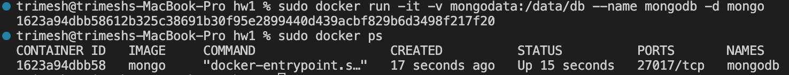
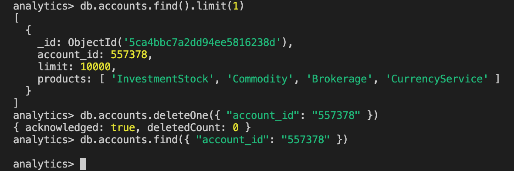
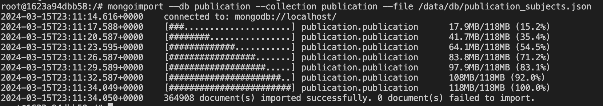

# MongoDB
Докер был уже скачан:


Далее был скачан образ MongoDB


И запушен с маунтом директории в которой будут лежать данные, чтобы они не потеряли.



Загрузим данные для тестов: датасет аналитики (customers, accounts, transactions).

```sh
docker cp customers.json mongodb:/data/db/customers.json
docker exec -it mongodb bash 
mongoimport --db analytics --collection customers --file /data/db/customers.json
```


Далее для взаимодеиствия внутри контейнера перейдем в интерактивный режим и посмотрим, что мы насоздавали: видим базы данных analytics с созданными коллекциями.


Рассмотрим данные подробнее с помощью команды `db.collection_name.find()`.

`db.accounts.find()`


`db.customers.find()`


`db.transactions.find()`


Так же можем задать фильтры, в данном случае по лимиту у аккаунты (меньше 1000).


## Теперь сделаем несколько CRUD:

### Create:


### Read:


### Update:


### Delete:


## Производительность

Для этого нужен датасет побольше, так как здесь операции выполняются за 1мс. [Возьмем этот](https://www.kaggle.com/datasets/shrashtisinghal/mongo-db-datsets?resource=download). Здесь представлены различные публикации, пример одного объекта ниже.




Размер дата сета:


Тогда попробуем сделать запрос по номеру книги. Время: 233мс.


Теперь с индексами. Время: 233мс.


Казалось, что такие индексы увеличат производительность, однако прибавки не заметно. Хотя каждая публикация имеет номер и казалось бы, что это поле  должно быть хорошим для индексации.

# Выводы 
В целом удобная достаточно быстро развертываемая база данных. Есть множество интерфейсов взаимодействия на все вкусы. Опыт использования положительный.