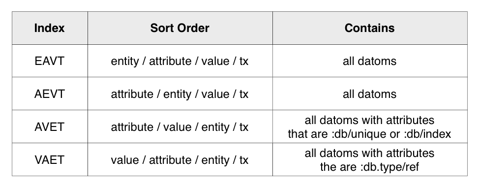
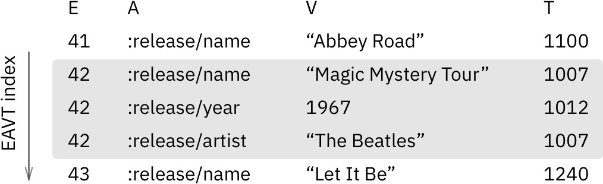
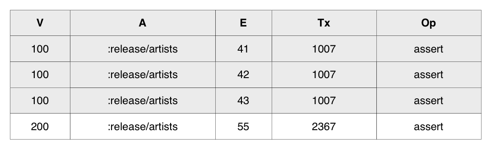

# Datomic - RelationalDB

### Основные принципы на которых построен Datomic

Datomic это масштабируемая, надежная, распределенная и согласованная база данных.

Основные принципы:
* **Неизменяемость и ACID:** Обеспечивают целостность данных даже при сложных параллельных операциях.
* **Упорядочивание по времени:** Позволяет выполнить запросы к истории изменений и создать журнал аудита.
* **Архитектура «peer to peer»:** Способствует горизонтальному масштабированию и отказоустойчивости.
* **Модель событийного источника:** Обеспечивает прозрачную и проверяемую историю изменений данных.

Это отличает Datomic от традиционных баз данных.
### 1. История развития Datomic DB

Datomic был создан в 2008 году компанией Cognitect, основанной Ричем Хиллом и Стивом МакКоннеллом, соавторами книги "Patterns of Enterprise Application Architecture".  

Примерный таймлайн разработок:
* **2008:** Первая версия Datomic была выпущена как проект с открытым исходным кодом.
* **2010:** Cognitect перешла на платную модель разработки, предлагая коммерческую поддержку Datomic.
* **2013:** Datomic 1.0 выпущен --  первая стабильная версия.
* **2016:** Cognitect была приобретена Amazon Web Services (AWS).
* **2020:** Datomic 1.1 выпущен -- добавлась поддержка sharding и другие функции. 
### 2. Инструменты для взаимодействия с Datomic DB


Для взаимодействия с Datomic DB существуют слудующие инструменты:
- **Datomic CLI:** Командная строка для управления базами данных, выполнения запросов и других операций.
- **Datomic Studio:** IDE с графическим интерфейсом для работы с Datomic DB.
- **Datomic Clojure API:** API Clojure для программноого взаимодействия с Datomic DB.
- **Библиотеки для других языков программирования:** Библиотеки Datomic доступны для Java, Python, JavaScript, Go и других языков.

### 3. Database Engine в Datomic DB

Datomic не ограничен одним конкретным базовым хранилищем данных. Он предлагает гибкость, поддерживая несколько вариантов хранения. Чаще всего используемые:

- **SQL:** PostgreSQL, MySQL и Oracle.
- **NoSQL:** DynamoDB, Cassandra, Riak и Couchbase.
- **n-Memory Storage:** бесплатная версия Datomic использует встроенную базу данных H2 SQL, которая хранит данные на ОЗУ (RAM).

Такой подход предоставляет вам выбор хранилища, который лучше всего подходит для конкретных нужд проекта. Выбор обычно делается на основе приоритетности следующих факторов: масштабируемость, производительность или уже существующая база данных.

В зависимости от выбранного database engine некоторые характеристики Datomic могут немного отличаться (производительность, масштабируемость и функциональность)

Важно отметить, что Datomic абстрагирует сложности работы с бэкэндами хранения. Это означает, что разработчикам приложений не нужно беспокоиться о том, как именно хранятся и управляются их данные. Datomic позаботится об этих деталях, обеспечивая единообразный и интуитивно понятный интерфейс для работы с данными.

Так же не менее интересно рассмотреть как хранятся сами данные.
Один объект представляется как набор datoms. Datom неизменяемый  атомарный типа и он представим следующим набором:
- идентификатор сущности (E)
- атрибут (A)
- значение атрибута (V)
- идентификатор транзакции (Tx)
- логическое значение (Op), указывающее, добавляется или удаляется datom

Пример объекта:

| E   | A                    | V      | Tx   | Op    |
| --- | -------------------- | ------ | ---- | ----- |
| 42  | :user/favorite-color | :blue  | 1234 | true  |
| 42  | :user/first-name     | "John" | 1234 | true  |
| 42  | :user/last-name      | "Doe"  | 1234 | true  |
| 42  | :user/favorite-color | :green | 4567 | true  |
| 42  | :user/favorite-color | :blue  | 4567 | false |
Каждая строчка является datom'ом. А вся эта часть таблице принадлежит объекту под номером 42.

[Больше здесь на эту тему здесь.](https://docs.datomic.com/cloud/whatis/data-model.html#database)
### 4. Язык запросов в Datomic DB
Datomic использует Datalog, декларативный язык запросов, основанный на логике предикатов. Datalog позволяет задавать запросы, не заботясь о том, как данные физически хранятся.

Пример развертывания базы данных с данными и выполнения запросов:
```Clojure
;; Создать базу данных
datomic create my-db

;; Добавить данные
datomic trans my-db (
	[:user/id 1 :user/name "Alice"]
	[:user/id 2 :user/name "Bob"]
	[:user/id 3 :user/name "Charlie"]
)

;; Выполнить запрос
datomic query my-db (
	(find ?u [:user/id ?id :user/name ?name])
)
```
Результат:
```Clojure
[(1 "Alice") (2 "Bob") (3 "Charlie")]
```

### 5. Распределение файлов БД по разным носителям

Datomic предлагает возможность распределения файлов своей базы данных по различным носителям. Это позволяет масштабировать базу данных горизонтально на несколько серверов и повысить ее общую доступность, так же может повысить производительность.

Варианты Распределения:
1. **Локальное Хранилище:** Этот подход хранит файлы базы данных непосредственно на локальном диске каждого сервера в кластере. Он подходит для небольших баз данных или сценариев, требующих доступа с низкой задержкой.
2. **Облачное Хранилище:** Здесь файлы базы данных находятся в облачном сервисе хранения, таком как Amazon S3 или Google Cloud Storage. Этот вариант идеален для баз данных большого масштаба или ситуаций, требующих высокой доступности.
3. **Распределенное Хранилище:** Этот метод распределяет файлы базы данных по нескольким серверам с использованием распределенной файловой системы, такой как GlusterFS или HDFS. Он подходит для очень больших баз данных, где высокая производительность и масштабируемость критичны.

### 6. На каком языке/ах программирования написана Datomic DB?

Datomic в основном написан на Clojure, функциональном языке программирования, построенном поверх JVM.
Основные особенности Clojure хорошо соответствуют принципам проектирования Datomic, что делает его подходящим выбором для разработки бд.

На **Clojure** написана бóльшая часть основного кода Datomic. Это включает в себя основные структуры данных, управление транзакциями и логику обработки запросов.

**Дополнительные языки:**
* **Java:** Некоторые части Datomic, особенно те, которые взаимодействуют с платформой Java или взаимодействуют с внешними системами, могут использовать код на Java.
* **JavaScript:** Для веб-приложений или пользовательских интерфейсов, включающих Datomic, JavaScript может использоваться для разработки клиентской части.

**Причины выбора Clojure:**
* Неизменяемость
* Concurrency
* Диалект Lisp (удобный синтаксис)

### 7. Типы индексов в Datomic DB и пример создания

Данная тема лучше разобрана понятней [на этом сайте](https://tonsky.me/blog/unofficial-guide-to-datomic-internals/), чем в официальной документации.

В Datomic все индексы являются covering indexes, то есть в них содержится сама дата. То есть если будет 3 индекса, данные будут храниться 3 раза. Индексы хранятся как B-Tree. Это позволяет их хранить отсортированами, неизменяемыми, постоянными, так же это позволяет хранить в нужном порядке, быстро доставать данные и просматривать сегменты данных (отрезки -- близкие по сортированным параметрам). Так же эта структура предоставляет эффективное слияние.

Всего пять индексов.

Четыре индекса содержат упорядоченные наборы datom'ов. Каждый из этих индексов называется на основе используемого порядка сортировки. E, A и V всегда сортируются по возрастанию, в то время как T всегда упорядочен по убыванию:



Так же есть пятый индекс -- **Log**, который сортирует по id транзакции.

Пример EAVT индекса:



- **EAVT:** эффективный доступ атрибута у объекта (похоже на primary key).
- **AEVT:** удобное получение объектов с одинаковым атрибутом.
- **VAET:** reverse index, позволяет эффективно взаимодеиствие с отношениями наоборот. На примере ([дб зvаписи песен и исполнителей](https://blog.datomic.com/2013/07/datomic-musicbrainz-sample-database.html)) можно заметить, как для исполнителя 100, что их релизы песен собраны вместе. Так же это отношение позволяет эффективно смотреть прямое и обратное следование: `“John” :follows ?x` и `?x :follows “John”`.



- **AVET:** эффективный просмотр по значению, где атрибуты помечены `unique` или `index`
- **Log:** сортировка по id транзакции.

Эти индексы служат различным целям и оптимизированы для различных типов доступа к данным в Datomic.

#### Пример создания индекса:

```Clojure
;; Создание индекса
(def my-aevt-index
  {:type :aevt
   :attr :my-attribute
   :entity :my-entity
   :value :my-value
   :time :my-time})

;; Применение индекса к дб
(create-index my-aevt-index)
```
### 8. Как строится процесс выполнения запросов в Datomic DB?

1. **Запрос клиента**

    Приложение отправляет запрос в Datomic. Этот запрос может быть на:
    - Datalog (Язык запросов Datomic)
    - Clojure
    - Библиотеки более высокого уровня

2. **Анализ и разбор запроса**

    Datomic получает запрос и выполняет глубокий анализ.
    - Разбирает синтаксис
    - Идентифицирует соответствующие элементы данных на основе структуры запроса.
    - Понимает предполагаемую операцию (поиск, извлечение итд), чтобы определить, как извлекать данные.

3. **Извлечение данных**

5. **Трансформация запроса**
    Datomic может преобразовывать данные из внутреннего представления в формат, указанный запросом или ожидаемый клиентским приложением.

6. **Предоставление результата**

Конвейер обработки запросов в Datomic использует неизменяемость, версионность, ленивые вычисления и оптимизация запросов, чтобы обеспечить надежный доступ к данным для сложных приложений.

### 9. Есть ли для Datomic DB понятие «план запросов»? Если да, объясните, как работает данный этап.

Datomic использует план запросов для оптимизации выполнения запросов. План запросов представляет собой дерево, которое описывает, как будут извлекаться данные из БД.

### 10. Поддерживаются ли транзакции в Datomic DB? Если да, то расскажите о нем. Если нет, то существует ли альтернатива?

Datomic поддерживает ACID-совместимые транзакции. Это означает, что транзакции являются **атомарными** (выполняются полностью или не выполняются вообще), **согласованными** (изменения, внесенные одной транзакцией, видны всем другим транзакциям, которые были выполнены после нее), **изолированными** (транзакции не влияют друг на друга) и **устойчивость** (изменения, внесенные транзакцией, сохраняются даже после сбоя системы).

### 11. Какие методы восстановления поддерживаются. Расскажите о них.


Datomic поддерживает несколько методов восстановления:
* **Восстановление из резервных копий:** Datomic позволяет создавать резервные копии базы данных в любой момент времени. В случае сбоя системы можно восстановить базу данных из резервной копии.

* **Восстановление с помощью журнала транзакций:** Datomic ведет журнал всех транзакций, внесенных в базу данных. В случае сбоя системы можно использовать журнал транзакций для восстановления базы данных до согласованного состояния.

* **Репликация:** Datomic поддерживает репликацию базы данных на несколько серверов. В случае сбоя одного сервера можно переключиться на другой сервер.

  

### 12. Расскажите про шардинг в Datomic DB. Какие типы используются? Принцип работы.

Datomic не использует шардинг в традиционном понимании. Вместо этого он использует горизонтальное масштабирование.

### 13. Возможно ли применить термины Data Mining, Data Warehousing и OLAP?

Datomic не предназначен для Data Mining, Data Warehousing или OLAP.

### 14. Какие методы защиты поддерживаются? Шифрование трафика, модели авторизации и т.п.

Datomic поддерживает следующие методы защиты:

* **Шифрование:** Datomic может шифровать данные как в состоянии покоя, так и в моменте передачи.

* **Авторизация:** Datomic поддерживает ролевую авторизацию, которая позволяет контролировать доступ к данным, так же позволяет подключить стороннюю или пользовательскую.

* **Аудит:** Datomic ведет журнал всех действий, выполняемых в базе данных.

### 15. Какие сообщества развивают данную СУБД? Кто в проекте имеет права на коммит и создание дистрибутива версий? Расскажите об этих людей и/или компаниях.

Datomic создается копания Cognitect. То есть продукт не open-source и сообщество не имеет возможность для дополнения кода.

### 16. Демонстрации работы Datomic DB

Простая демонстрация может быть сделана с помощь [Max Datom](https://max-datom.com/).

### 17. Как продолжить самостоятельное изучение языка запросов с помощью демобазы. Если демобазы нет, то создайте ее.

- [Datomic Community Demo](https://docs.datomic.com/pro) – это бесплатная и общедоступная демобаза.

Дополнительно в изучении помогут:

- [Datomic Learning Experience](https://max-datom.com/) - бесплатный сайт для изучения Datomic

- [Datomic Tutorials](https://docs.datomic.com/pro/tutorial/introduction.html) – помогает познакомиться с языком запросов и основами работы с базой данных.
- [Datomic Community Forum](https://forum.datomic.com/)


### 18. Где найти документацию и пройти обучение

[Datomic Documentation](https://docs.datomic.com/) – официальная документация Datomic, которая содержит подробные сведения о языке запросов, включая синтаксис, функции и примеры.


- [Datomic Documentation](https://docs.datomic.com/)

- [Datomic Courses](https://learndatomic.com/)


### 19. Как быть в курсе происходящего
  

- [Datomic Blog](https://blog.datomic.com/)

- [Datomic Twitter](https://twitter.com/datomic_team)

- [Datomic Forum](https://forum.datomic.com/)
